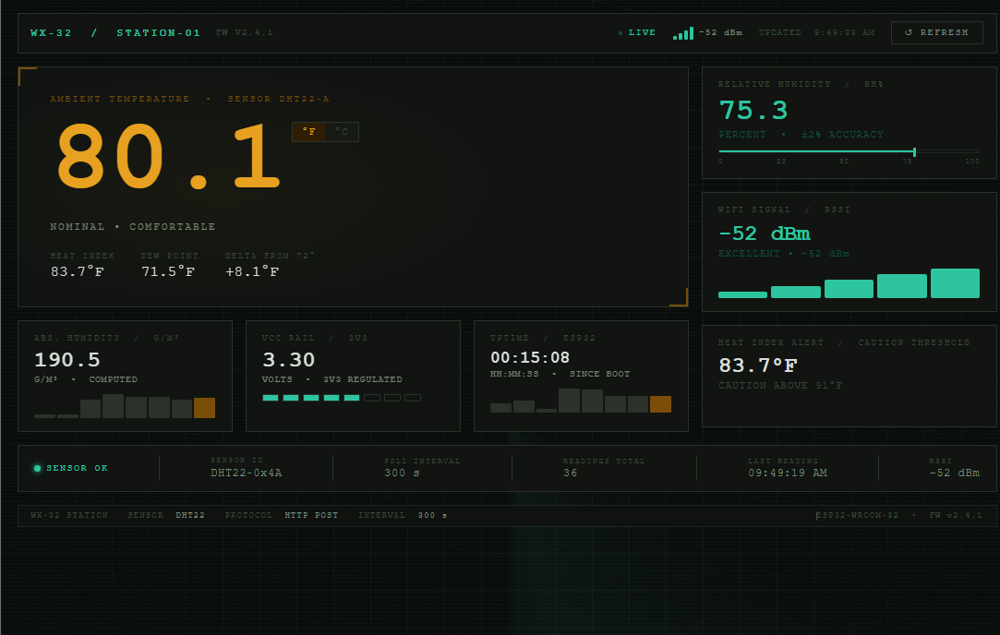

# ESP32 Wi-Fi Weather Station

A full-stack IoT weather station built with an ESP32 microcontroller and DHT22 sensor. The ESP32 reads temperature and humidity every 5 minutes and POSTs the data over Wi-Fi to a local Flask backend, which stores readings in SQLite and serves a live dashboard.



---

## How it works

```
ESP32 + DHT22
    → HTTP POST every 5 min
        → Flask backend (Python)
            → SQLite database
                → Live web dashboard
```

The ESP32 and the host machine sit on the same local network. Flask listens on `0.0.0.0:5000`, making it reachable from any device on the network. The dashboard fetches `/latest` on load and auto-refreshes every 5 minutes to stay in sync with the sensor poll interval.

---

## Stack

| Layer | Technology |
|---|---|
| Microcontroller | ESP32-WROOM-32 (Elegoo) |
| Sensor | DHT22 — temperature & humidity |
| Firmware | Arduino (C++) |
| Backend | Python · Flask · SQLite |
| Frontend | Vanilla HTML/CSS/JavaScript · Chart.js |

---

## Features

- **Real sensor data** — temperature (°F/°C), humidity, heat index, dew point, absolute humidity
- **Live ESP32 diagnostics** — WiFi RSSI signal strength, VCC rail voltage, device uptime
- **Industrial dashboard UI** — radar sweep animation, RSSI signal bars, humidity gauge, sparklines, warning states
- **°F / °C toggle** — all computed values update instantly
- **Heat index alert** — visual warning badge triggers above 91°F
- **Auto-refresh** — dashboard syncs every 5 minutes with no interaction needed
- **Error state** — red banner if Flask server is unreachable

---

## Project structure

```
esp32-weather-station/
├── app.py                  # Flask routes — POST /readings, GET /readings, GET /latest
├── database.py             # SQLite init, insert, and query functions
├── templates/
│   └── index.html          # Live dashboard (single-file, vanilla JS)
├── firmware/
│   └── weather_station.ino # ESP32 Arduino sketch
├── screenshots/
│   └── dashboard.png
└── .gitignore
```

---

## Setup

### Requirements

- Python 3.8+
- Arduino IDE with ESP32 board support installed
- ESP32 dev board + DHT22 sensor
- Adafruit DHT sensor library
- ArduinoJson library

### Backend

```bash
# Clone the repo
git clone https://github.com/YOUR_USERNAME/esp32-weather-station.git
cd esp32-weather-station

# Create and activate virtual environment
python -m venv venv
venv\Scripts\activate        # Windows
source venv/bin/activate     # Mac/Linux

# Install dependencies
pip install flask

# Run the server
python app.py
```

Flask starts on `http://0.0.0.0:5000`. Open `http://localhost:5000` to see the dashboard.

### Firmware

1. Open `firmware/weather_station.ino` in Arduino IDE
2. Fill in your Wi-Fi credentials and your computer's local IP address at the top of the file
3. Install required libraries via **Tools → Manage Libraries**: `DHT sensor library` by Adafruit, `ArduinoJson` by Benoit Blanchon
4. Select **ESP32 Dev Module** under **Tools → Board**
5. Upload — hold the **BOOT** button when you see `Connecting...` in the console

### Wiring

| DHT22 Pin | ESP32 Pin |
|---|---|
| VCC | 3.3V |
| GND | GND |
| DATA | GPIO 4 (D4) |

The DHT22 breakout module has the pull-up resistor built in. If using a raw 4-pin DHT22, add a 10kΩ resistor between VCC and DATA.

---

## API

| Endpoint | Method | Description |
|---|---|---|
| `/` | GET | Live dashboard |
| `/readings` | POST | Receive a reading from ESP32 |
| `/readings` | GET | All stored readings as JSON |
| `/latest` | GET | Most recent reading as JSON |

### Reading schema

```json
{
  "id": 42,
  "temperature_c": 22.8,
  "temperature_f": 73.0,
  "humidity": 58.4,
  "rssi": -67,
  "vcc": 3.3,
  "uptime": 3600,
  "timestamp": "2025-06-15T14:32:10.441"
}
```
